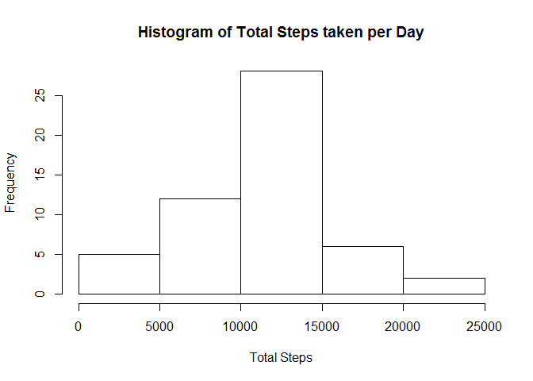

# Reproducible Research: Course Project 1

The purpose of the this course project is to read, process and make interpretations about the data from activity monitoring devices such as a Fitbit, Nike Fuelband or jawbone Up. This data can be obtained from: <https://d396qusza40orc.cloudfront.net/repdata%2Fdata%2Factivity.zip>. Primarily, there are three questions this document will answer:

1. What is the mean total number of steps taken per day?
2. What is the average daily activity pattern?
3. Are there differences in activity patterns between weekdays and weekends?

## Reading and processing the data

###Download dataset, unzip file and store in variable called *ActivityMon* 


```r
## Store the URL location of the Activity Monitoring dataset
fileURL <- "https://d396qusza40orc.cloudfront.net/repdata%2Fdata%2Factivity.zip"

## Set the current working directory
setwd("C:/Users/latreaz/Documents/Coursera/Reproducible code")

## Download the file and unzip into current working directory
download.file(fileURL,destfile = "./ActivityMon.zip")
unzip("./ActivityMon.zip")

## Read the .CSV file into R and store in new variable "ActivityMon"
ActivityMon <- read.csv("./Activity.csv",header = TRUE)

## Convert Interval column from Integer to Factor variable
ActivityMon$interval <- as.factor(ActivityMon$interval)
```
## First Analysis: What is the mean total number of steps taken per day?

In order to fully analyze this question we need to first review some basic observations regarding the data.  

1. What is the **total** number of steps taken per day? The following table shows the total number of steps listed by date.


```r
TotalSteps <- aggregate(steps~date,data=ActivityMon,sum)
print(TotalSteps)
```

```
##          date steps
## 1  2012-10-02   126
## 2  2012-10-03 11352
## 3  2012-10-04 12116
## 4  2012-10-05 13294
## 5  2012-10-06 15420
## 6  2012-10-07 11015
## 7  2012-10-09 12811
## 8  2012-10-10  9900
## 9  2012-10-11 10304
## 10 2012-10-12 17382
## 11 2012-10-13 12426
## 12 2012-10-14 15098
## 13 2012-10-15 10139
## 14 2012-10-16 15084
## 15 2012-10-17 13452
## 16 2012-10-18 10056
## 17 2012-10-19 11829
## 18 2012-10-20 10395
## 19 2012-10-21  8821
## 20 2012-10-22 13460
## 21 2012-10-23  8918
## 22 2012-10-24  8355
## 23 2012-10-25  2492
## 24 2012-10-26  6778
## 25 2012-10-27 10119
## 26 2012-10-28 11458
## 27 2012-10-29  5018
## 28 2012-10-30  9819
## 29 2012-10-31 15414
## 30 2012-11-02 10600
## 31 2012-11-03 10571
## 32 2012-11-05 10439
## 33 2012-11-06  8334
## 34 2012-11-07 12883
## 35 2012-11-08  3219
## 36 2012-11-11 12608
## 37 2012-11-12 10765
## 38 2012-11-13  7336
## 39 2012-11-15    41
## 40 2012-11-16  5441
## 41 2012-11-17 14339
## 42 2012-11-18 15110
## 43 2012-11-19  8841
## 44 2012-11-20  4472
## 45 2012-11-21 12787
## 46 2012-11-22 20427
## 47 2012-11-23 21194
## 48 2012-11-24 14478
## 49 2012-11-25 11834
## 50 2012-11-26 11162
## 51 2012-11-27 13646
## 52 2012-11-28 10183
## 53 2012-11-29  7047
```

2. We need to plot the total number of steps taken per day to visually determine our most and least active days. The following Histogram shows that between 10,000 and 15,000 daily steps were the most frequent number of steps taken, occurring on more than 25 out of 53 days in this dataset.


```r
hist(TotalSteps$steps,main = "Histogram of Total Steps taken per Day",xlab = "Total Steps")
```

<!-- -->

3. Finally, we need to determine the mean and median number of steps taken each day. 


```r
ActivityMean <- mean(TotalSteps$steps)
ActivityMedian <- median(TotalSteps$steps)
print(ActivityMean)
```

```
## [1] 10766.19
```

```r
print(ActivityMedian)
```

```
## [1] 10765
```

## Second Analysis: What is the average daily activity pattern?

1. Show a time-series plot of the 5-minute interval (x-axis) and the average number of steps taken , average across all days (y-axis)


```r
AvgSteps <- tapply(ActivityMon$steps, ActivityMon$interval, mean, na.rm = TRUE)
head(AvgSteps)
```

```
##         0         5        10        15        20        25 
## 1.7169811 0.3396226 0.1320755 0.1509434 0.0754717 2.0943396
```

```r
plot.ts(x=row.names(AvgSteps),AvgSteps, type="l",main="Average Daily Activity Pattern",xlab = "5-minute interval",ylab = "Avg # of steps")
```

<!-- -->

2. Which 5-minute interval, on average across all the days in the dataset contains the maximum number of steps?


```r
rownames(AvgSteps)[AvgSteps == max(AvgSteps)]
```

```
## [1] "835"
```
## Third Analysis: Imputing missing values

Here, we need to determine methods to deal with missing values within the dataset.

1. First, the total number of missing values in the dataset need to be calculated.


```r
sum(!complete.cases(ActivityMon))
```

```
## [1] 2304
```

2. Second, a strategy for filling in all of the missing values in the dataset need to be devised.  **To deal with the missing values this study will utilize the 5-minute interval mean calculated in the second analysis.**

3. Next, a new dataset need to be created that will substitute the 5-minute interval mean for the NA's.


```r
## Make AvgSteps a table

AvgSteps <- as.data.frame(AvgSteps)

## Loop through dataset and for every step that has a NA value, update with AvgStep
for (i in 1:length(ActivityMon$steps)) {
 if (is.na(ActivityMon$steps[i])==TRUE) {
   Intervalvalue <- as.character(ActivityMon$interval[i])
   NewAvgStep <- AvgSteps[rownames(AvgSteps) == Intervalvalue,1]
   ActivityMon$steps[i] <- NewAvgStep
 }
} 
##Print updated dataset
head(ActivityMon,100)
```

```
##           steps       date interval
## 1     1.7169811 2012-10-01        0
## 2     0.3396226 2012-10-01        5
## 3     0.1320755 2012-10-01       10
## 4     0.1509434 2012-10-01       15
## 5     0.0754717 2012-10-01       20
## 6     2.0943396 2012-10-01       25
## 7     0.5283019 2012-10-01       30
## 8     0.8679245 2012-10-01       35
## 9     0.0000000 2012-10-01       40
## 10    1.4716981 2012-10-01       45
## 11    0.3018868 2012-10-01       50
## 12    0.1320755 2012-10-01       55
## 13    0.3207547 2012-10-01      100
## 14    0.6792453 2012-10-01      105
## 15    0.1509434 2012-10-01      110
## 16    0.3396226 2012-10-01      115
## 17    0.0000000 2012-10-01      120
## 18    1.1132075 2012-10-01      125
## 19    1.8301887 2012-10-01      130
## 20    0.1698113 2012-10-01      135
## 21    0.1698113 2012-10-01      140
## 22    0.3773585 2012-10-01      145
## 23    0.2641509 2012-10-01      150
## 24    0.0000000 2012-10-01      155
## 25    0.0000000 2012-10-01      200
## 26    0.0000000 2012-10-01      205
## 27    1.1320755 2012-10-01      210
## 28    0.0000000 2012-10-01      215
## 29    0.0000000 2012-10-01      220
## 30    0.1320755 2012-10-01      225
## 31    0.0000000 2012-10-01      230
## 32    0.2264151 2012-10-01      235
## 33    0.0000000 2012-10-01      240
## 34    0.0000000 2012-10-01      245
## 35    1.5471698 2012-10-01      250
## 36    0.9433962 2012-10-01      255
## 37    0.0000000 2012-10-01      300
## 38    0.0000000 2012-10-01      305
## 39    0.0000000 2012-10-01      310
## 40    0.0000000 2012-10-01      315
## 41    0.2075472 2012-10-01      320
## 42    0.6226415 2012-10-01      325
## 43    1.6226415 2012-10-01      330
## 44    0.5849057 2012-10-01      335
## 45    0.4905660 2012-10-01      340
## 46    0.0754717 2012-10-01      345
## 47    0.0000000 2012-10-01      350
## 48    0.0000000 2012-10-01      355
## 49    1.1886792 2012-10-01      400
## 50    0.9433962 2012-10-01      405
## 51    2.5660377 2012-10-01      410
## 52    0.0000000 2012-10-01      415
## 53    0.3396226 2012-10-01      420
## 54    0.3584906 2012-10-01      425
## 55    4.1132075 2012-10-01      430
## 56    0.6603774 2012-10-01      435
## 57    3.4905660 2012-10-01      440
## 58    0.8301887 2012-10-01      445
## 59    3.1132075 2012-10-01      450
## 60    1.1132075 2012-10-01      455
## 61    0.0000000 2012-10-01      500
## 62    1.5660377 2012-10-01      505
## 63    3.0000000 2012-10-01      510
## 64    2.2452830 2012-10-01      515
## 65    3.3207547 2012-10-01      520
## 66    2.9622642 2012-10-01      525
## 67    2.0943396 2012-10-01      530
## 68    6.0566038 2012-10-01      535
## 69   16.0188679 2012-10-01      540
## 70   18.3396226 2012-10-01      545
## 71   39.4528302 2012-10-01      550
## 72   44.4905660 2012-10-01      555
## 73   31.4905660 2012-10-01      600
## 74   49.2641509 2012-10-01      605
## 75   53.7735849 2012-10-01      610
## 76   63.4528302 2012-10-01      615
## 77   49.9622642 2012-10-01      620
## 78   47.0754717 2012-10-01      625
## 79   52.1509434 2012-10-01      630
## 80   39.3396226 2012-10-01      635
## 81   44.0188679 2012-10-01      640
## 82   44.1698113 2012-10-01      645
## 83   37.3584906 2012-10-01      650
## 84   49.0377358 2012-10-01      655
## 85   43.8113208 2012-10-01      700
## 86   44.3773585 2012-10-01      705
## 87   50.5094340 2012-10-01      710
## 88   54.5094340 2012-10-01      715
## 89   49.9245283 2012-10-01      720
## 90   50.9811321 2012-10-01      725
## 91   55.6792453 2012-10-01      730
## 92   44.3207547 2012-10-01      735
## 93   52.2641509 2012-10-01      740
## 94   69.5471698 2012-10-01      745
## 95   57.8490566 2012-10-01      750
## 96   56.1509434 2012-10-01      755
## 97   73.3773585 2012-10-01      800
## 98   68.2075472 2012-10-01      805
## 99  129.4339623 2012-10-01      810
## 100 157.5283019 2012-10-01      815
```

4a. Make a histogram of the total number of steps taken each day


```r
## First calculate the total number of steps taken each day
TotalSteps <- aggregate(steps~date,data=ActivityMon,sum)

hist(TotalSteps$steps,main = "Histogram of Total Steps taken per Day",xlab = "Total Steps")
```

<!-- -->

```r
## Create the histogram
```

4b. Calculate and report the mean and median total number of steps taken per day.


```r
ActivityMean <- mean(TotalSteps$steps)
ActivityMedian <- median(TotalSteps$steps)
print(ActivityMean)
```

```
## [1] 10766.19
```

```r
print(ActivityMedian)
```

```
## [1] 10766.19
```

  Do these values differ from the estimates from the first part of the assignment?  **Not really. The median slightly changes from 10765, to 10766.19 which is equal to the mean.**
  
  What is the impact of imputing missing data on the estimates of the total daily numer of steps? **There is not any impact on imputing missing values on the Activity monitor data using the average daily steps.**
  
## Fourth Analysis: Are there differnces in activity patterns between weekdays and weekends?

1. Create a new factor variable in the dataset with two levels - "weekday" and "weekend" indicating whether a given date is a weekday or weekend.


```r
library(timeDate)
for (i in 1:length(ActivityMon$date)) {
  if (isWeekday(ActivityMon$date[i])==TRUE) {
    ActivityMon$IsWeekend[i] <- c("weekday")
  }
    else {
      ActivityMon$IsWeekend[i] <- c("weekend")
    } 
}
head(ActivityMon,50)
```

```
##        steps       date interval IsWeekend
## 1  1.7169811 2012-10-01        0   weekday
## 2  0.3396226 2012-10-01        5   weekday
## 3  0.1320755 2012-10-01       10   weekday
## 4  0.1509434 2012-10-01       15   weekday
## 5  0.0754717 2012-10-01       20   weekday
## 6  2.0943396 2012-10-01       25   weekday
## 7  0.5283019 2012-10-01       30   weekday
## 8  0.8679245 2012-10-01       35   weekday
## 9  0.0000000 2012-10-01       40   weekday
## 10 1.4716981 2012-10-01       45   weekday
## 11 0.3018868 2012-10-01       50   weekday
## 12 0.1320755 2012-10-01       55   weekday
## 13 0.3207547 2012-10-01      100   weekday
## 14 0.6792453 2012-10-01      105   weekday
## 15 0.1509434 2012-10-01      110   weekday
## 16 0.3396226 2012-10-01      115   weekday
## 17 0.0000000 2012-10-01      120   weekday
## 18 1.1132075 2012-10-01      125   weekday
## 19 1.8301887 2012-10-01      130   weekday
## 20 0.1698113 2012-10-01      135   weekday
## 21 0.1698113 2012-10-01      140   weekday
## 22 0.3773585 2012-10-01      145   weekday
## 23 0.2641509 2012-10-01      150   weekday
## 24 0.0000000 2012-10-01      155   weekday
## 25 0.0000000 2012-10-01      200   weekday
## 26 0.0000000 2012-10-01      205   weekday
## 27 1.1320755 2012-10-01      210   weekday
## 28 0.0000000 2012-10-01      215   weekday
## 29 0.0000000 2012-10-01      220   weekday
## 30 0.1320755 2012-10-01      225   weekday
## 31 0.0000000 2012-10-01      230   weekday
## 32 0.2264151 2012-10-01      235   weekday
## 33 0.0000000 2012-10-01      240   weekday
## 34 0.0000000 2012-10-01      245   weekday
## 35 1.5471698 2012-10-01      250   weekday
## 36 0.9433962 2012-10-01      255   weekday
## 37 0.0000000 2012-10-01      300   weekday
## 38 0.0000000 2012-10-01      305   weekday
## 39 0.0000000 2012-10-01      310   weekday
## 40 0.0000000 2012-10-01      315   weekday
## 41 0.2075472 2012-10-01      320   weekday
## 42 0.6226415 2012-10-01      325   weekday
## 43 1.6226415 2012-10-01      330   weekday
## 44 0.5849057 2012-10-01      335   weekday
## 45 0.4905660 2012-10-01      340   weekday
## 46 0.0754717 2012-10-01      345   weekday
## 47 0.0000000 2012-10-01      350   weekday
## 48 0.0000000 2012-10-01      355   weekday
## 49 1.1886792 2012-10-01      400   weekday
## 50 0.9433962 2012-10-01      405   weekday
```

2. Make a panel plot containing a time series plot of the 5-minute interval (x-axis) and the average number of steps taken, averaged across all weekday days or weekend days(y-axis).


```r
library(ggplot2)

WeekdayActivity <- subset(ActivityMon,ActivityMon$IsWeekend=="weekday")
WeekendActivity <- subset(ActivityMon,ActivityMon$IsWeekend=="weekend")

WeekdayAvgSteps <- tapply(WeekdayActivity$steps, WeekdayActivity$interval, mean, na.rm = TRUE)
WeekendAvgSteps <- tapply(WeekendActivity$steps, WeekendActivity$interval, mean, na.rm=TRUE)

WeekdayAvgSteps <- as.data.frame(WeekdayAvgSteps)
WeekendAvgSteps <- as.data.frame(WeekendAvgSteps)

colnames(WeekdayAvgSteps) <- "AvgSteps"
colnames(WeekendAvgSteps) <- "AvgSteps"

for (i in 1:length(WeekdayAvgSteps)) {
  WeekdayAvgSteps$Day[i] <- c("weekday")
}

for (i in 1: length(WeekendAvgSteps)) {
  WeekendAvgSteps$Day[i] <- c("weekend")
}

library(tibble)
WeekdayAvgSteps <- rownames_to_column(WeekdayAvgSteps,"Interval")
WeekendAvgSteps <- rownames_to_column(WeekendAvgSteps,"Interval")

FinalData <- rbind(WeekdayAvgSteps,WeekendAvgSteps)

head(FinalData,50)
```

```
##    Interval   AvgSteps     Day
## 1         0 2.25115304 weekday
## 2         5 0.44528302 weekday
## 3        10 0.17316562 weekday
## 4        15 0.19790356 weekday
## 5        20 0.09895178 weekday
## 6        25 1.59035639 weekday
## 7        30 0.69266247 weekday
## 8        35 1.13794549 weekday
## 9        40 0.00000000 weekday
## 10       45 1.79622642 weekday
## 11       50 0.39580713 weekday
## 12       55 0.01761006 weekday
## 13      100 0.42054507 weekday
## 14      105 0.09056604 weekday
## 15      110 0.19790356 weekday
## 16      115 0.44528302 weekday
## 17      120 0.00000000 weekday
## 18      125 1.45953878 weekday
## 19      130 2.22180294 weekday
## 20      135 0.02264151 weekday
## 21      140 0.22264151 weekday
## 22      145 0.25031447 weekday
## 23      150 0.34633124 weekday
## 24      155 0.00000000 weekday
## 25      200 0.00000000 weekday
## 26      205 0.00000000 weekday
## 27      210 1.39538784 weekday
## 28      215 0.00000000 weekday
## 29      220 0.00000000 weekday
## 30      225 0.17316562 weekday
## 31      230 0.00000000 weekday
## 32      235 0.29685535 weekday
## 33      240 0.00000000 weekday
## 34      245 0.00000000 weekday
## 35      250 2.02851153 weekday
## 36      255 1.23689727 weekday
## 37      300 0.00000000 weekday
## 38      305 0.00000000 weekday
## 39      310 0.00000000 weekday
## 40      315 0.00000000 weekday
## 41      320 0.02767296 weekday
## 42      325 0.81635220 weekday
## 43      330 1.23857442 weekday
## 44      335 0.52243187 weekday
## 45      340 0.42096436 weekday
## 46      345 0.09895178 weekday
## 47      350 0.00000000 weekday
## 48      355 0.00000000 weekday
## 49      400 0.26960168 weekday
## 50      405 1.23689727 weekday
```

```r
p <- ggplot(FinalData, aes(x=as.numeric(Interval),y=AvgSteps,group=1)) + geom_line(color="blue") + facet_wrap(~Day,ncol = 1) + xlab("5-minute Interval")
print(p)
```

<!-- -->

